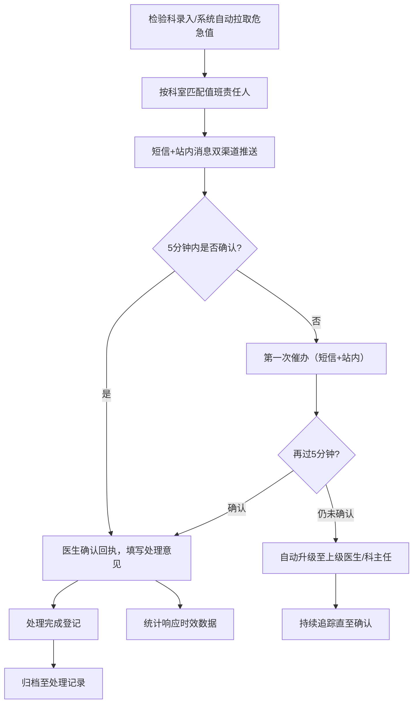
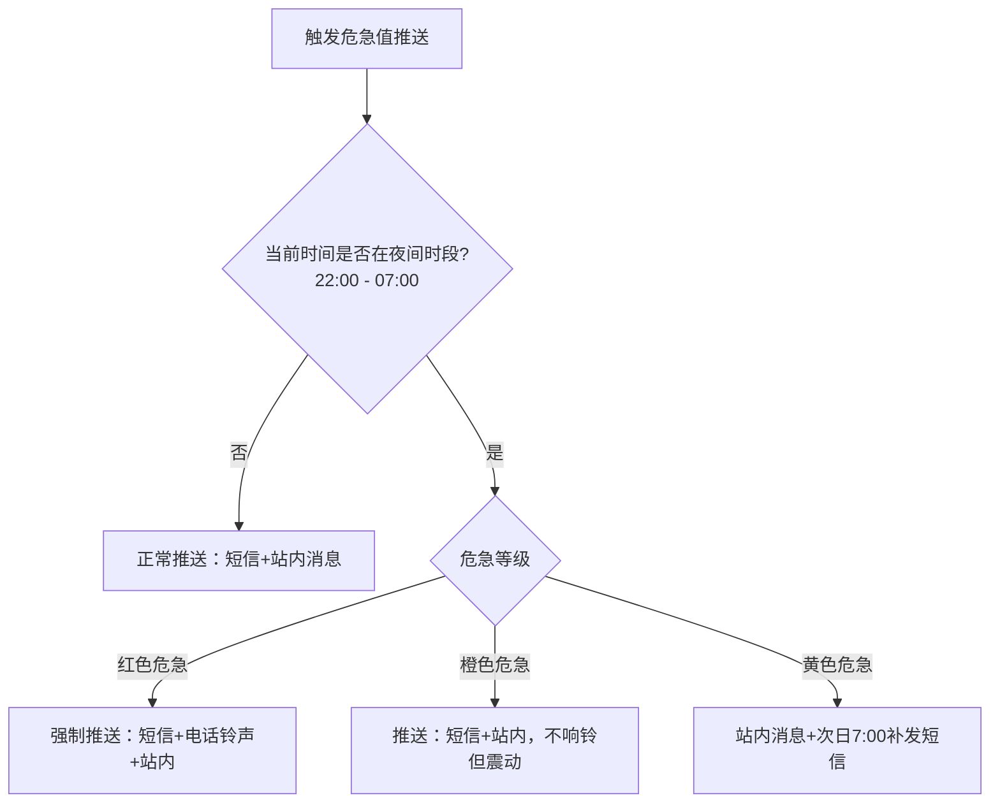

# 检验危急值推送助手 PRD

## 1. 产品概述

检验危急值推送助手是一款面向检验科、临床科室值班医生和护士长的医疗危急值管理系统，专注于确保每一条必须立即处理的检验结果都能"发出去、有人接、有人回、有人追到底"。通过自动化推送、多渠道提醒、分级升级和全程追踪，最大限度缩短危急值响应时间，保障患者安全。

## 2. 核心功能

### 2.1 用户角色

| 角色 | 说明 | 核心权限 |
|------|------|----------|
| 检验科人员 | 负责录入/审核危急值，触发推送 | 录入危急值、补发通知、查看全局处理记录 |
| 值班医生 | 接收并处理本科室危急值 | 确认回执、登记处理意见、查看本科室记录 |
| 护士长 | 监控护理单元危急值响应 | 查看科室状态、督促处理、统计响应时效 |
| 系统管理员 | 配置系统参数 | 管理接收人、值班表、黑名单、策略配置 |

### 2.2 功能模块

1. **危急值列表模块**：展示当前所有待处理、处理中、已完成的危急值项目，支持按科室、状态、项目类型筛选
2. **接收人管理模块**：管理科室人员信息、值班表配置、黑名单设置、通知渠道偏好
3. **确认回执模块**：医生查看详情并确认接收危急值，填写处理意见和措施
4. **升级提醒模块**：展示超时未确认的危急值升级记录，自动通知上级医生
5. **处理记录模块**：完整的历史记录查询、补发通知、按项目统计响应时效

### 2.3 页面详情

| 页面/模块 | 子模块 | 功能描述 |
|-----------|--------|----------|
| 危急值列表 | 实时列表 | 卡片式展示危急值，包含患者信息、项目、结果、危急等级、推送时间、当前状态 |
| 危急值列表 | 筛选工具栏 | 按科室、危急等级（红/橙/黄）、状态（待推送/已推送/已确认/已升级/已完成）、时间范围筛选 |
| 危急值列表 | 快速操作 | 一键补发、标记误报、查看详情 |
| 接收人管理 | 人员列表 | 展示所有接收人：姓名、科室、职务、手机号、通知渠道、是否值班中 |
| 接收人管理 | 值班表配置 | 按日期/班次配置值班人员，支持日班/夜班/节假日切换 |
| 接收人管理 | 黑名单管理 | 临时屏蔽非值班人员，设置屏蔽时间段和原因 |
| 接收人管理 | 通知渠道 | 配置短信/站内消息双渠道开关，夜间静默策略 |
| 确认回执 | 详情面板 | 患者信息、检验项目详情、参考范围、历史对比、推送记录时间线 |
| 确认回执 | 回执表单 | 确认接收、填写处理措施、预估处理完成时间、上传附件（可选） |
| 升级提醒 | 升级列表 | 展示所有触发升级的危急值：超时时间、升级路径、当前责任人 |
| 升级提醒 | 升级规则 | 配置不同危急等级的催办间隔（如5min/10min/15min）、升级层级 |
| 处理记录 | 历史查询 | 按患者、科室、项目、时间段检索历史危急值处理记录 |
| 处理记录 | 补发通知 | 对已处理的记录重新发送通知给指定人员 |
| 处理记录 | 统计看板 | 按检验项目统计：平均响应时间、超时率、确认率、处理完成率 |

## 3. 核心流程

### 3.1 危急值处理主流程

### 3.2 夜间处理策略

## 4. 用户界面设计

### 4.1 设计风格

**整体风格**：专业医疗级 · 高对比度 · 功能优先 · 紧急情况视觉突出

- **主色调**：深蓝 `#1e3a5f`（专业、信任）
- **辅助色**：
  - 红色危急 `#dc2626`（最高优先级，闪烁动效）
  - 橙色危急 `#ea580c`（高优先级，脉冲动效）
  - 黄色危急 `#ca8a04`（中优先级，高亮显示）
  - 成功绿色 `#16a34a`（确认/完成）
  - 中性灰 `#64748b`（辅助信息）
- **按钮样式**：圆角8px，实心主按钮配白色文字，紧急按钮配红色光晕
- **字体**：
  - 标题：思源黑体 Bold，数字用等宽字体
  - 正文：思源黑体 Regular，14px 为主
  - 危急数值：大号加粗等宽字体，配对应等级颜色背景
- **布局风格**：左侧导航栏 + 顶部状态栏 + 主内容区卡片式布局
- **图标风格**：线条型图标，危急项配实心警示图标

### 4.2 页面设计概览

| 模块 | 关键UI元素 | 设计要点 |
|------|-----------|----------|
| 危急值列表 | 状态标签、倒计时徽章、卡片边框颜色编码 | 红色危急卡片配闪烁边框，倒计时实时更新，超出时间变红 |
| 接收人管理 | 在线状态点、值班徽章、渠道开关图标 | 值班人员头像配绿色光圈，黑名单配灰色斜体 |
| 确认回执 | 时间线记录、大按钮确认区、处理意见输入框 | 时间线用不同颜色节点区分推送/确认/升级/完成事件 |
| 升级提醒 | 升级路径图、超时警告图标、责任人链展示 | 用连线箭头展示升级链路，超时时间配醒目标红 |
| 处理记录 | 统计卡片、趋势图、筛选面板 | 平均响应时间用渐变色进度条展示，超时率超阈值配红色警示 |

### 4.3 响应式设计

- 桌面端优先（1280px+）：五模块Tab切换 + 宽表格展示
- 平板端（768-1279px）：侧边栏折叠为图标，卡片自适应排列
- 移动端（<768px）：底部Tab导航，列表改为单列堆叠，关键操作按钮悬浮固定

### 4.4 动效与交互

- **危急值卡片入场**：红色级从左侧滑入带震动感，橙色级淡入上滑
- **倒计时**：最后30秒数字跳动 + 背景色渐变加深
- **确认回执提交**：按钮圆形扩散动画 → 绿色对勾弹出
- **升级触发**：顶部弹出红色通知条 + 轻微震动反馈（移动端）
