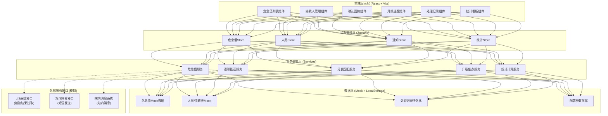
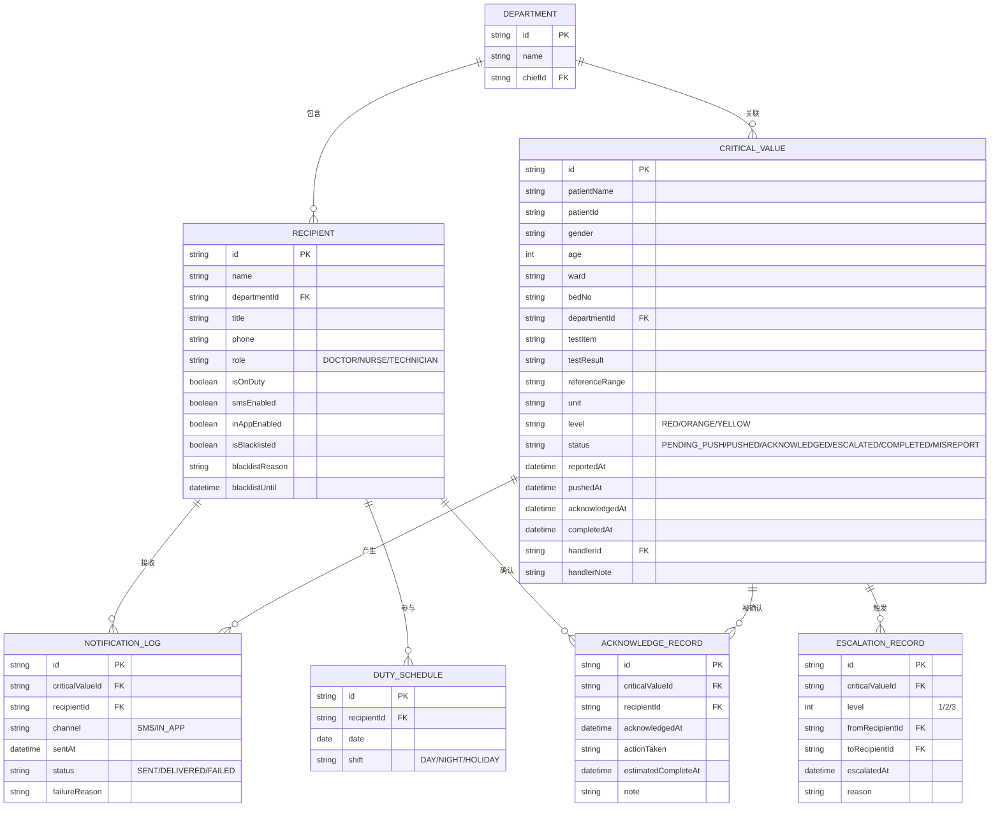

# 检验危急值推送助手 技术架构文档

## 1. 架构设计



## 2. 技术选型

- **前端框架**：React@18 + TypeScript
- **构建工具**：Vite@5
- **样式方案**：TailwindCSS@3 + CSS变量主题
- **状态管理**：Zustand（轻量，适合中小规模应用）
- **图标库**：Lucide React（医疗风格线条图标）
- **图表组件**：Recharts（响应时效统计图表）
- **数据持久化**：LocalStorage（处理记录、配置项）
- **后端**：无后端，使用Mock数据模拟

## 3. 模块路由

| 路由路径 | 模块组件 | 说明 |
|----------|---------|------|
| `/critical-values` | CriticalValueList | 危急值列表（首页默认） |
| `/recipients` | RecipientManagement | 接收人管理 |
| `/acknowledge/:id` | AcknowledgePanel | 确认回执详情 |
| `/escalation` | EscalationDashboard | 升级提醒看板 |
| `/records` | ProcessingRecords | 处理记录与统计 |

## 4. 核心数据模型

### 4.1 数据模型ER图



### 4.2 升级规则配置

```typescript
interface EscalationRule {
  level: 'RED' | 'ORANGE' | 'YELLOW';
  firstReminderMinutes: number;    // 首次催办时间
  reminderIntervalMinutes: number; // 催办间隔
  maxReminders: number;           // 最大催办次数
  escalationLevels: number;       // 升级层级数
  nightStartHour: number;         // 夜间开始（22）
  nightEndHour: number;           // 夜间结束（7）
  nightPolicy: {
    RED: 'FORCE_SMS_RING';
    ORANGE: 'SMS_VIBRATE';
    YELLOW: 'INAPP_NEXT_DAY';
  };
}

const DEFAULT_RULES: EscalationRule[] = [
  { level: 'RED', firstReminderMinutes: 5, reminderIntervalMinutes: 5, maxReminders: 3, escalationLevels: 2, nightStartHour: 22, nightEndHour: 7, nightPolicy: { RED: 'FORCE_SMS_RING', ORANGE: 'SMS_VIBRATE', YELLOW: 'INAPP_NEXT_DAY' } },
  { level: 'ORANGE', firstReminderMinutes: 10, reminderIntervalMinutes: 10, maxReminders: 2, escalationLevels: 2, nightStartHour: 22, nightEndHour: 7, nightPolicy: { RED: 'FORCE_SMS_RING', ORANGE: 'SMS_VIBRATE', YELLOW: 'INAPP_NEXT_DAY' } },
  { level: 'YELLOW', firstReminderMinutes: 15, reminderIntervalMinutes: 15, maxReminders: 2, escalationLevels: 1, nightStartHour: 22, nightEndHour: 7, nightPolicy: { RED: 'FORCE_SMS_RING', ORANGE: 'SMS_VIBRATE', YELLOW: 'INAPP_NEXT_DAY' } },
];
```

## 5. 关键服务接口

### 5.1 危急值服务

```typescript
interface CriticalValueService {
  fetchLatest(): Promise<CriticalValue[]>;
  getById(id: string): CriticalValue | undefined;
  markAsPushed(id: string): void;
  markAsMisreport(id: string, reason: string): void;
  resendNotification(id: string, recipientIds: string[]): Promise<NotificationLog[]>;
}
```

### 5.2 分发匹配服务

```typescript
interface DispatchService {
  matchRecipients(cv: CriticalValue): Recipient[];
  getOnDutyDoctorByDepartment(deptId: string): Recipient[];
  getEscalationChain(cv: CriticalValue, currentLevel: number): Recipient[];
}
```

### 5.3 通知推送服务

```typescript
interface NotificationService {
  sendSms(recipient: Recipient, cv: CriticalValue): Promise<NotificationLog>;
  sendInApp(recipient: Recipient, cv: CriticalValue): Promise<NotificationLog>;
  sendDualChannel(recipient: Recipient, cv: CriticalValue): Promise<NotificationLog[]>;
  applyNightPolicy(recipient: Recipient, cv: CriticalValue): NotificationLog[];
}
```

### 5.4 升级催办服务

```typescript
interface EscalationService {
  checkAndRemind(): EscalationRecord[];
  escalate(cvId: string, reason: string): EscalationRecord;
  getResponseMinutes(cv: CriticalValue): number;
  isOverdue(cv: CriticalValue): boolean;
}
```

### 5.5 统计服务

```typescript
interface StatisticsService {
  avgResponseTimeByItem(startDate: Date, endDate: Date): { item: string; avgMinutes: number; count: number }[];
  overdueRateByDepartment(startDate: Date, endDate: Date): { dept: string; rate: number; total: number; overdue: number }[];
  acknowledgeRateByRecipient(startDate: Date, endDate: Date): { person: string; rate: number; total: number }[];
}
```

## 6. 前端项目结构

```
src/
├── assets/               # 静态资源
├── components/
│   ├── layout/          # 布局组件（Sidebar、Header、StatusBadge）
│   ├── common/          # 通用组件（Button、Modal、Tag、Timeline）
│   ├── critical-values/ # 危急值模块组件
│   ├── recipients/      # 接收人管理组件
│   ├── acknowledge/     # 回执组件
│   ├── escalation/      # 升级组件
│   └── records/         # 记录统计组件
├── stores/              # Zustand状态管理
├── services/            # 业务服务层
├── types/               # TypeScript类型定义
├── mock/                # Mock数据生成器
├── utils/               # 工具函数（时间、格式化、策略判断）
├── hooks/               # 自定义hooks
├── App.tsx
├── main.tsx
└── index.css
```
